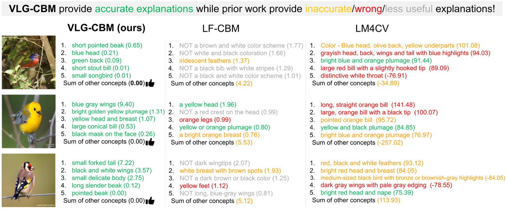

# VLG-CBM: Training Concept Bottleneck Models with Vision-Language Guidance

This is the official repository for our paper _VLG-CBM: Training Concept Bottleneck Models with Vision-Language Guidance_.

- **VLG-CBM** provides a novel method to train Concept Bottleneck Models(CBMs) with guidance from both vision and language domain.
- **VLG-CBM** provides concise and accurate concept attribution for the decision made by the model. The following figure compares decision explanation of VLG-CBM with existing methods by listing top-five contributions for their decisions.

<p align="center">
  
</p>

## Table of Contents

1. [Setup](#setup)
2. [Training](#training)
3. [Results](#results)

## Setup

1. Install Python (3.9) and PyTorch (1.13).
2. Install dependencies by running `pip install -r requirements.txt`
3. Install Grounding DINO: `https://github.com/IDEA-Research/GroundingDINO.git` and download `groundingdino_swinb_cogcoor.pth` to the `GroundingDINO`.
4. Download pretrained models by running `bash download_models.sh` (they will be unpacked to `saved_models`)
5. Download and process CUB dataset by running `bash download_cub.sh`

### Prepare and organize data

All datasets should be under a single folder specified by environment variable `$DATASET_FOLDER`. Suppose the dataset folder is `~/datasets`. The structure should looks like this

```
~/datasets
  - imagenet
    - train
    - val
  - CUB
    - train
    - test
  - places365
    ...
```

To download and process CUB dataset, please run `bash download_cub.sh` and move the folder under `$DATASET_FOLDER`. To use ImageNet dataset, you need to download the ImageNet dataset yourself and put it under `$DATASET_FOLDER`. The other datasets could be downloaded automatically by Torchvision. After preparing all the datasets, specify the environment variable by

```bash
export DATASET_FOLDER={PATH_TO_YOUR_DATASET}
```

## Training

### Annotate images with Grounding Dino

1. Run the following command to annotate the images with Grounding-DINO. Replace `<dataset-name>` with the dataset you want to annotate. The supported datasets are `cub`, `places365`, `imagenet`, `cifar10`, `cifar100`. The annotation files will be saved under `.annotations` folder.

  ```bash
  python prepare_dataset.py --dataset <dataset-name> --device cuda --batch_size 32 --text_threshold 0.15 --output_dir .annotations
  ```

  Note: Please ensure that `DATASET_ROOTS` correctly points to the datasets in [data_utils.py](data_utils.py) before running the command.

2. Alternatively, you can download the pre-annotated files from [here](https://ucsdcloud-my.sharepoint.com/:f:/g/personal/ddivyansh_ucsd_edu/EiUtC9dHgAhKjVUt3z7GbPABEg0cbn3EGET8W8jSHaWm3g?e=qVKXYG) and put them under `.annotations` folder.

### Train VLG-CBM

Train a concept bottleneck model, you could use the config files under `./configs`. For example, to train a CIFAR10 model, use

`python train_cbm.py --config configs/cifar10.json --annotation_dir .annotations`

### Evaluate trained models

As we discussed in the paper, to enable a fair comparison of model performance, the Number of Effective Concepts (NEC) needs to be controlled. To evaluate model under different NEC, use

```bash
python sparse_evaluation.py --load_path YOUR_PATH_TO_MODEL
```

Replace `YOUR_PATH_TO_MODEL` to the output path from `train_cbm.py`.

## Results

**Accuracy(NEC=5):**

| Dataset       | CIFAR10     | CIFAR100    | CUB200      | Places365   | ImageNet    |
| ------------- | ----------- | ----------- | ----------- | ----------- | ----------- |
| Random        | 67.55\%     | 29.52\%     | 68.91\%     | 17.57\%     | 41.49\%     |
| LF-CBM        | 84.05\%     | 56.52\%     | 53.51\%     | 37.65\%     | 60.30\%     |
| LM4CV         | 53.72\%     | 14.64\%     | N/A         | N/A         | N/A         |
| LaBo          | 78.69\%     | 44.82\%     | N/A         | N/A         | N/A         |
| VLG-CBM(Ours) | **88.55\%** | **65.73\%** | **75.79\%** | **41.92\%** | **73.15\%** |

(The results for LM4CV and LaBo is not reported for datasets that use non-CLIP backbone, as they only support CLIP image encoder as the backbone.)

## Sources

CUB dataset: <https://www.vision.caltech.edu/datasets/cub_200_2011/>

Sparse final layer training: <https://github.com/MadryLab/glm_saga>

Explanation bar plots adapted from: <https://github.com/slundberg/shap>

CLIP: <https://github.com/openai/CLIP>

Label-free CBM: <https://github.com/Trustworthy-ML-Lab/Label-free-CBM>

Grounding DINO: <https://github.com/IDEA-Research/GroundingDINO>

## Cite this work

```txt
@article{srivastava&yan2024vlgcbm,
  title={VLG-CBM: Training Concept Bottleneck Models with Vision-Language Guidance},
  author={Srivastava, Divyansh and Yan, Ge and Weng, Tsui-Wei},
  journal={arXiv preprint},
  year={2024}
}
```
