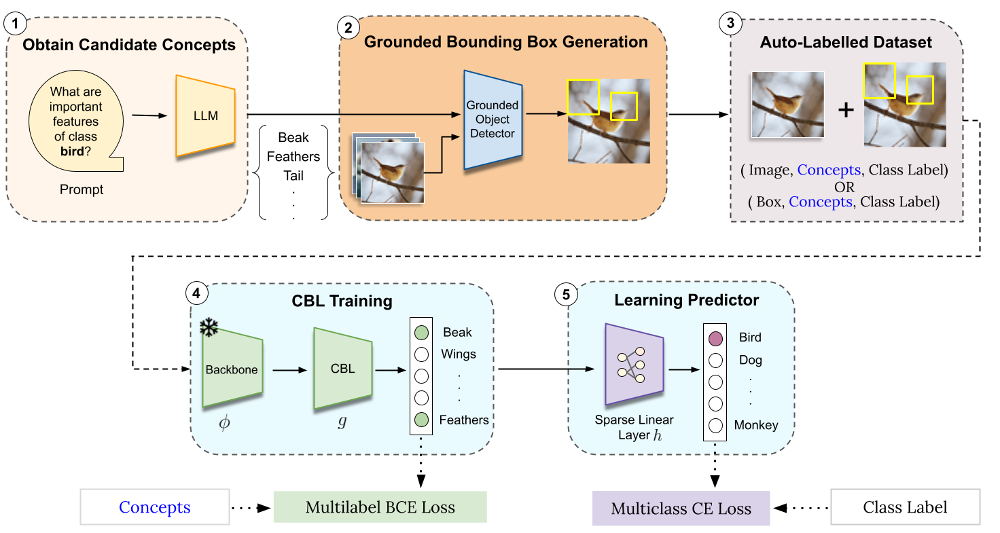
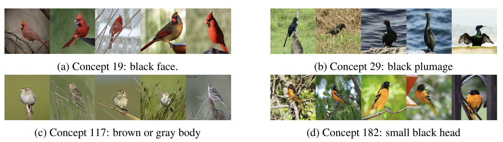

<!-- omit in toc -->
# Vision-Language-Guided Concept Bottleneck Model (VLG-CBM)

**This is the official repository for our paper _VLG-CBM: Training Concept Bottleneck Models with Vision-Language Guidance_, NeurIPS 2024.** [[Project Website]](https://lilywenglab.github.io/VLG-CBM/) [[Paper]](https://arxiv.org/pdf/2408.01432)

- **VLG-CBM** provides a novel method to train Concept Bottleneck Models(CBMs) with guidance from both vision and language domain.
- **VLG-CBM** provides concise and accurate concept attribution for the decision made by the model. The following figure compares decision explanation of VLG-CBM with existing methods by listing top-five contributions for their decisions.

<p align="center">
  
</p>

<!-- omit in toc -->
## Table of Contents

- [Setup](#setup)
- [Quick Start](#quick-start)
- [Training](#training)
  - [Overview](#overview)
  - [Annotation Generation (Optional)](#annotation-generation-optional)
  - [Training Pipeline](#training-pipeline)
  - [Evaluate trained models](#evaluate-trained-models)
- [Results](#results)
- [Sources](#sources)
- [Cite this work](#cite-this-work)

## Setup

1. Setup conda environment and install dependencies

```bash
  conda create -n vlg-cbm python=3.12
  conda activate vlg-cbm
  pip install -r requirements.txt
```

2. (optional) Install Grounding DINO for generating annotations on custom datasets

```
git clone https://github.com/IDEA-Research/GroundingDINO
cd GroundingDINO
pip install -e .
wget https://github.com/IDEA-Research/GroundingDINO/releases/download/v0.1.0-alpha2/groundingdino_swinb_cogcoor.pth
cd ..
```


## Quick Start

We provide scripts to download and evaluate pretrained models for CIFAR10, CIFAR100, CUB200, Places365, and ImageNet. To quickly evaluate the pretrained models, follow the steps below:

1. Download pretrained models from [here](https://ucsdcloud-my.sharepoint.com/:f:/g/personal/ddivyansh_ucsd_edu/EmfooVZ_r4JFqHVEtzBFqDkBbGC0nN2vXrsAOVltMPE39A?e=mQVcnS), unzip them, and place them in the `saved_models` folder.
2. Run evaluation script to evaluate the pretrained models under different NEC and obtain Accuracy at different NEC (ANEC) for each dataset.

```bash
python sparse_evaluation.py --load_path <path-to-model-dir>
```

For example, to evaluate the pretrained model for CUB200, run

```bash
python sparse_evaluation.py --load_path saved_models/cub
```

## Training

### Overview

<p align="center">
  
</p>

### Annotation Generation (Optional)

To train VLG-CBM, images must be annotated with concepts from a Vision-Language model, and this work uses Grounding-DINO for annotation generation. Use the following command to generate annotations for a dataset:

```bash
python -m scripts.generate_annotations --dataset <dataset-name> --device cuda --batch_size 32 --text_threshold 0.15 --output_dir annotations
```

Note: Supported datasets include `cifar10`, `cifar100`, `cub`, `places365`, and `imagenet`. The generated annotations will be saved under `annotations` folder.

### Training Pipeline

1. Download annotated data from [here](https://ucsdcloud-my.sharepoint.com/:f:/g/personal/ddivyansh_ucsd_edu/EiUtC9dHgAhKjVUt3z7GbPABEg0cbn3EGET8W8jSHaWm3g?e=EZM72s), unzip them, and place it in the `annotations` folder or generate it using Grounding DINO as described in the previous section.

2. All datasets must be placed in a single folder specified by the environment variable `$DATASET_FOLDER`. By default, `$DATASET_FOLDER` is set to `datasets`.

Note: To download and process CUB dataset, please run `bash download_cub.sh` and move the folder under `$DATASET_FOLDER`. To use ImageNet dataset, you need to download the ImageNet dataset yourself and put it under `$DATASET_FOLDER`. The other datasets could be downloaded automatically by Torchvision.

3. Train a concept bottleneck model using the config files in `./configs`. For instance, to train a CUB model, run the following command:
  
```bash
  python train_cbm.py --config configs/cub.json --annotation_dir annotations
```

### Evaluate trained models

Number of Effective Concepts (NEC) needs to be controlled to enable a fair comparison of model performance. To evaluate a trained model under different NEC, run the following command:

```bash
python sparse_evaluation.py --load_path <path-to-model-dir> --lam <lambda-value>
```

## Results

**Accuracy at NEC=5 (ANEC-5) for non-CLIP backbone models**

| Dataset       | CIFAR10     | CIFAR100    | CUB200      | Places365   | ImageNet    |
| ------------- | ----------- | ----------- | ----------- | ----------- | ----------- |
| Random        | 67.55\%     | 29.52\%     | 68.91\%     | 17.57\%     | 41.49\%     |
| LF-CBM        | 84.05\%     | 56.52\%     | 53.51\%     | 37.65\%     | 60.30\%     |
| LM4CV         | 53.72\%     | 14.64\%     | N/A         | N/A         | N/A         |
| LaBo          | 78.69\%     | 44.82\%     | N/A         | N/A         | N/A         |
| VLG-CBM(Ours) | **88.55\%** | **65.73\%** | **75.79\%** | **41.92\%** | **73.15\%** |

**Accuracy at NEC=5 (ANEC-5) for CLIP backbone models**

| Dataset        | CIFAR10     | CIFAR100    | ImageNet | CUB |
|----------------|----------- | ----------- | ----------------|-----------|
| Random        | 67.55\%     | 29.52\%     | 18.04\%         | 25.37\%    |
| LF-CBM         |  84.05\%     | 56.52\%     | 52.88%         | 31.35%    |
| LM4CV          |53.72\%     | 14.64\%     |  3.77%          | 3.63%     |
| LaBo           | 78.69\%     | 44.82\%     | 24.27%         | 41.97%    |
| VLG-CBM (Ours) | **88.55\%** | **65.73\%** |**59.74\%**         | **60.38\%**    |

**Explainable Decisions**

<p align="center">
  
</p>
<!-- <p align="center">
  <em>Figure 4: Visualization of Top-5 activated images of randomly selected neurons with VLG-CBM on the CUB dataset. VLG-CBM faithfully captures concepts that are aligned with human perception.</em>
</p> -->

## Sources

- CUB dataset: <https://www.vision.caltech.edu/datasets/cub_200_2011/>

- Sparse final layer training: <https://github.com/MadryLab/glm_saga>

- Explanation bar plots adapted from: <https://github.com/slundberg/shap>

- CLIP: <https://github.com/openai/CLIP>

- Label-free CBM: <https://github.com/Trustworthy-ML-Lab/Label-free-CBM>

- Grounding DINO: <https://github.com/IDEA-Research/GroundingDINO>

## Cite this work

If you find this work useful, please consider citing:

```
@inproceedings{srivastava2024vlg,
        title={VLG-CBM: Training Concept Bottleneck Models with Vision-Language Guidance},
        author={Srivastava, Divyansh and Yan, Ge and Weng, Tsui-Wei},
        journal={NeurIPS},
        year={2024}
}
```
